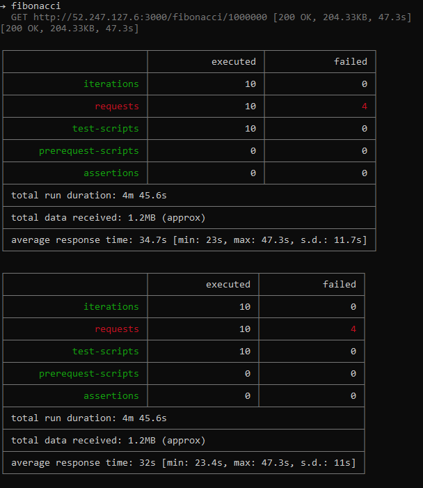

### Escuela Colombiana de Ingeniería
### Arquitecturas de Software - ARSW

## Integrantes 

Juan Sebastian Nieto Molina

Juan Manuel Herrera Moya

## Escalamiento en Azure con Maquinas Virtuales, Sacale Sets y Service Plans

## Comandos 

Si estas en windows y te retorna un permiso denegado user@host: Permission denied (publickey).

      ssh-i ~/.ssh/private_key username@host
      
Si es en linux, recuerda que puede ser por no dar permisos al archivo de llave privada, puedes usasr chmod 400.
      
### Dependencias
* Cree una cuenta gratuita dentro de Azure. Para hacerlo puede guiarse de esta [documentación](https://azure.microsoft.com/en-us/free/search/?&ef_id=Cj0KCQiA2ITuBRDkARIsAMK9Q7MuvuTqIfK15LWfaM7bLL_QsBbC5XhJJezUbcfx-qAnfPjH568chTMaAkAsEALw_wcB:G:s&OCID=AID2000068_SEM_alOkB9ZE&MarinID=alOkB9ZE_368060503322_%2Bazure_b_c__79187603991_kwd-23159435208&lnkd=Google_Azure_Brand&dclid=CjgKEAiA2ITuBRDchty8lqPlzS4SJAC3x4k1mAxU7XNhWdOSESfffUnMNjLWcAIuikQnj3C4U8xRG_D_BwE). Al hacerlo usted contará con $200 USD para gastar durante 1 mes.

### Parte 0 - Entendiendo el escenario de calidad

Adjunto a este laboratorio usted podrá encontrar una aplicación totalmente desarrollada que tiene como objetivo calcular el enésimo valor de la secuencia de Fibonnaci.

**Escalabilidad**
Cuando un conjunto de usuarios consulta un enésimo número (superior a 1000000) de la secuencia de Fibonacci de forma concurrente y el sistema se encuentra bajo condiciones normales de operación, todas las peticiones deben ser respondidas y el consumo de CPU del sistema no puede superar el 70%.

### Parte 1 - Escalabilidad vertical

1. Diríjase a el [Portal de Azure](https://portal.azure.com/) y a continuación cree una maquina virtual con las características básicas descritas en la imágen 1 y que corresponden a las siguientes:
    * Resource Group = SCALABILITY_LAB
    * Virtual machine name = VERTICAL-SCALABILITY
    * Image = Ubuntu Server 
    * Size = Standard B1ls
    * Username = scalability_lab
    * SSH publi key = Su llave ssh publica


2. Para conectarse a la VM use el siguiente comando, donde las `x` las debe remplazar por la IP de su propia VM.

    `ssh scalability_lab@xxx.xxx.xxx.xxx`
    


3. Instale node, para ello siga la sección *Installing Node.js and npm using NVM* que encontrará en este [enlace](https://linuxize.com/post/how-to-install-node-js-on-ubuntu-18.04/).


4. Para instalar la aplicación adjunta al Laboratorio, suba la carpeta `FibonacciApp` a un repositorio al cual tenga acceso y ejecute estos comandos dentro de la VM:

    `git clone <your_repo>`

    `cd <your_repo>/FibonacciApp`

    `npm install`


5. Para ejecutar la aplicación puede usar el comando `npm FibinacciApp.js`, sin embargo una vez pierda la conexión ssh la aplicación dejará de funcionar. Para evitar ese compartamiento usaremos *forever*. Ejecute los siguientes comando dentro de la VM.

    `npm install forever -g`

    `forever start FibinacciApp.js`

6. Antes de verificar si el endpoint funciona, en Azure vaya a la sección de *Networking* y cree una *Inbound port rule* tal como se muestra en la imágen. Para verificar que la aplicación funciona, use un browser y user el endpoint `http://xxx.xxx.xxx.xxx:3000/fibonacci/6`. La respuesta debe ser `The answer is 8`.


7. La función que calcula en enésimo número de la secuencia de Fibonacci está muy mal construido y consume bastante CPU para obtener la respuesta. Usando la consola del Browser documente los tiempos de respuesta para dicho endpoint usando los siguintes valores:

    * 1000000


    * 1010000
    

    * 1020000


    * 1030000


    * 1040000


    * 1050000


    * 1060000


    * 1070000


    * 1080000


    * 1090000    


8. Dírijase ahora a Azure y verifique el consumo de CPU para la VM. (Los resultados pueden tardar 5 minutos en aparecer).


9. Ahora usaremos Postman para simular una carga concurrente a nuestro sistema. Siga estos pasos.
    * Instale newman con el comando `npm install newman -g`. Para conocer más de Newman consulte el siguiente [enlace](https://learning.getpostman.com/docs/postman/collection-runs/command-line-integration-with-newman/).
    * Diríjase hasta la ruta `FibonacciApp/postman` en una maquina diferente a la VM.
    * Para el archivo `[ARSW_LOAD-BALANCING_AZURE].postman_environment.json` cambie el valor del parámetro `VM1` para que coincida con la IP de su VM.
    * Ejecute el siguiente comando.

    ```
    newman run ARSW_LOAD-BALANCING_AZURE.postman_collection.json -e [ARSW_LOAD-BALANCING_AZURE].postman_environment.json -n 10 &
    newman run ARSW_LOAD-BALANCING_AZURE.postman_collection.json -e [ARSW_LOAD-BALANCING_AZURE].postman_environment.json -n 10
    ```
    


10. La cantidad de CPU consumida es bastante grande y un conjunto considerable de peticiones concurrentes pueden hacer fallar nuestro servicio. Para solucionarlo usaremos una estrategia de Escalamiento Vertical. En Azure diríjase a la sección *size* y a continuación seleccione el tamaño `B2ms`.


11. Una vez el cambio se vea reflejado, repita el paso 7, 8 y 9.

NOTA: No olvidar correr el siguiente comando otra vez:

      forever start FibinacciApp.js
      





12. Evalue el escenario de calidad asociado al requerimiento no funcional de escalabilidad y concluya si usando este modelo de escalabilidad logramos cumplirlo.

      >- Al cambiar el tamaño a `B2ms`hubo un comportamiento positivo, pero no fue significante teniendo en cuenta el costo que tiene hacer dicho cambio, el porcentaje de uso de CPU mejora un 2% aproximadamente y el tiempo mejora en 5 segundos. Ahora, el objetivo si se está cumpliendo al implementar escalabilidad vertical, pero sentimos que no aprovecha al 100% los nuevos recursos para hacer un mejor trabajo, ademas que no sirve para ejecutar procesos paralelos. 
      
      
13. Vuelva a dejar la VM en el tamaño inicial para evitar cobros adicionales.

**Preguntas**

1. ¿Cuántos y cuáles recursos crea Azure junto con la VM?

      >- Por maquina Azure cera 6 recursos, los cuales son:
      
            Red virtual
            Máquina virtual
            Dirección IP pública
            Grupo de seguridad de red
            La intefaz de red
            Disco

2. ¿Brevemente describa para qué sirve cada recurso?

      >- Red virtual: Permite que recursos de Azure, como Azure Virtual Machines (VM), se comuniquen de forma segura entre sí, Internet y redes locales. La red virtual es similar a una red tradicional que operaría en su propio centro de datos, pero aporta beneficios adicionales de la infraestructura de Azure, como la escala, la disponibilidad y el aislamiento.
      >- Máquina virtual: Proporciona un espacio de nombres único para los datos de Azure Storage a los que se puede acceder desde cualquier lugar del mundo a través de HTTP o HTTPS. 
      >- Grupo de seguridad de red: Puede usar un grupo de seguridad de red de Azure para filtrar el tráfico de red hacia y desde los recursos de Azure en una red virtual de Azure.
      >- Dirección de IP pública: Las direcciones IP públicas permiten que los recursos de Azure se comuniquen con Internet y los servicios de Azure orientados al público
      >- La interfaz de red: . Una interfaz de red permite que una máquina virtual de Azure se comunique con Internet, Azure y los recursos locales.
      >- Disco: El tamaño de la máquina virtual determina cuántos discos de datos puede adjuntar.
      
3. ¿Al cerrar la conexión ssh con la VM, por qué se cae la aplicación que ejecutamos con el comando `npm FibonacciApp.js`? ¿Por qué debemos crear un *Inbound port rule* antes de acceder al servicio?
      >- Lo que nosotros hacemos al conectarnos remotamente con la maquina por medio de llaves publicas y privadas, por medio de protocolo ssh para ser mas especifico, es hacer una conección con los recursos de esta máquina, pero cuando se va a ejecutar un comando se inicia o cierra la conexion, lo que hace es crar una instancia de ello, por eso no vive cuando la conexión se cierra.
Debemos crear un Inbound port rule, porque necesitamos tener un puerto al cual se pueda conectar nuestra aplicación, en particular se escoge el 3000.

4. Adjunte tabla de tiempos e interprete por qué la función tarda tando tiempo.
            
            Número	B1ls	B2ms
            1000000	27.62	23.39
            1010000	28.20	24.03
            1020000	28.82	23.91
            1030000	29.50	25.33
            1040000	30.05	26.10
            1050000	30.68	25.93
            1060000	31.12	26.48
            1070000	31.79	26.79
            1080000	32.74	27.29
            1090000	33.55	27.28

5. Adjunte imágen del consumo de CPU de la VM e interprete por qué la función consume esa cantidad de CPU.

      >- Esta imagen es cuando tenemos B1ls, y la razón principal del consumo de CPU es que el proceso de cálculo es secuencial y no aprovecha las propiedad de la programación dinámica ya que al ingresar otro número el cálculo se debe hacer completamente desde cero y repite operaciones. 


6. Adjunte la imagen del resumen de la ejecución de Postman. Interprete:

    * Esta imagen es cuando tenemos B1ls-
    * Tiempos de ejecución de cada petición.
      Como se ve en la imgaen hubo un tiempo promedio de 27 segundos.
    * Si hubo fallos documentelos y explique.
    Como se ve en la imagen falla, la razon es que no puede hacer ejecuciones en paralelo.


    
7. ¿Cuál es la diferencia entre los tamaños `B2ms` y `B1ls` (no solo busque especificaciones de infraestructura)?

      >- Primero entendamos que son estos tamaños, los tamaños de VM de uso general proporcionan una relación equilibrada entre CPU y memoria. Ideal para desarrollo y pruebas, bases de datos pequeñas o medianas, y servidores web de tráfico bajo o medio. Las máquinas virtuales ampliables de la serie B son idóneas para cargas de trabajo que no necesitan un rendimiento completo de la CPU de forma continua, como los servidores web, pequeñas bases de datos y entornos de desarrollo y de prueba.
Lo primero que vemos es la diferencia de sus componentes, por lo cual el tamaño B1ls tiene menos capacidad para ejecutar operaciones que la B2ms y se ve evidenciado en su precio.

            Tamaño de máquina	      Familia	    vCPU	RAM(GIB)	Discos de datos	E/S máximo por segundo	Almacenamiento temporal(GIB)	Disco prémium	Costo/mes
                  B2ms	            Uso general	      2	    8	            4	                  1920	                  16	               Se admite	60.74 US$
                  B1ls        	Uso general	      1	   0.5	      2	                  160	                  4	               Se admite	3.80  US$

8. ¿Aumentar el tamaño de la VM es una buena solución en este escenario?, ¿Qué pasa con la FibonacciApp cuando cambiamos el tamaño de la VM?

      >- Hablando tecnicamente pudo mejorar los tiempos de ejecución, el porcentaje de CPU mejoro, pero fue muy poco a comparación de B1ls, ademas no se justifica pagar casi 20 veces más por mejoras tan leves, tal vez es porque no aprobecha todos sus nuevos recursos.
      
9. ¿Qué pasa con la infraestructura cuando cambia el tamaño de la VM? ¿Qué efectos negativos implica?

      >- El principal efecto es que esta se reinicia, debemos volver a ejectuar programas que ya teniamos corriendo, como volver a ejectuar el comando forever start FibinacciApp.js, admas, durante este tiempo caido podemos perder las peticiones que se hagan.

10. ¿Hubo mejora en el consumo de CPU o en los tiempos de respuesta? Si/No ¿Por qué?

      >- Sí, aunque la mejora fue leve, un 2% con respecto a la B1ls, principalmente por los componentes que tiene, trae 2 vCPU, e indiscutiblemente más RAM, lo cual le permite ejecutar programas con mayor fluidez debido a sus capacidades, pero usando programacion dinámica podrian aprobecharse mas estos componentes e indudablemente mejorar los tiempo y el porcentanje de CPU.
      
11. Aumente la cantidad de ejecuciones paralelas del comando de postman a `4`. ¿El comportamiento del sistema es porcentualmente mejor?

      >- Use la siguiente linea de codigo newman run ARSW_LOAD-BALANCING_AZURE.postman_collection.json -e [ARSW_LOAD-BALANCING_AZURE].postman_environment.json -n 10 & newman run ARSW_LOAD-BALANCING_AZURE.postman_collection.json -e [ARSW_LOAD-BALANCING_AZURE].postman_environment.json -n 10 & newman run ARSW_LOAD-BALANCING_AZURE.postman_collection.json -e [ARSW_LOAD-BALANCING_AZURE].postman_environment.json -n 4 y el resultado fue el miso.

### Parte 2 - Escalabilidad horizontal

#### Crear el Balanceador de Carga

Antes de continuar puede eliminar el grupo de recursos anterior para evitar gastos adicionales y realizar la actividad en un grupo de recursos totalmente limpio.

1. El Balanceador de Carga es un recurso fundamental para habilitar la escalabilidad horizontal de nuestro sistema, por eso en este paso cree un balanceador de carga dentro de Azure tal cual como se muestra en la imágen adjunta.


2. A continuación cree un *Backend Pool*, guiese con la siguiente imágen.


3. A continuación cree un *Health Probe*, guiese con la siguiente imágen.


4. A continuación cree un *Load Balancing Rule*, guiese con la siguiente imágen.


5. Cree una *Virtual Network* dentro del grupo de recursos, guiese con la siguiente imágen.


#### Crear las maquinas virtuales (Nodos)

Ahora vamos a crear 3 VMs (VM1, VM2 y VM3) con direcciones IP públicas standar en 3 diferentes zonas de disponibilidad. Después las agregaremos al balanceador de carga.

1. En la configuración básica de la VM guíese por la siguiente imágen. Es importante que se fije en la "Avaiability Zone", donde la VM1 será 1, la VM2 será 2 y la VM3 será 3.


2. En la configuración de networking, verifique que se ha seleccionado la *Virtual Network*  y la *Subnet* creadas anteriormente. Adicionalmente asigne una IP pública y no olvide habilitar la redundancia de zona.


3. Para el Network Security Group seleccione "avanzado" y realice la siguiente configuración. No olvide crear un *Inbound Rule*, en el cual habilite el tráfico por el puerto 3000. Cuando cree la VM2 y la VM3, no necesita volver a crear el *Network Security Group*, sino que puede seleccionar el anteriormente creado.


4. Ahora asignaremos esta VM a nuestro balanceador de carga, para ello siga la configuración de la siguiente imágen.


5. Finalmente debemos instalar la aplicación de Fibonacci en la VM. para ello puede ejecutar el conjunto de los siguientes comandos, cambiando el nombre de la VM por el correcto

```
git clone https://github.com/daprieto1/ARSW_LOAD-BALANCING_AZURE.git

curl -o- https://raw.githubusercontent.com/creationix/nvm/v0.34.0/install.sh | bash
source /home/vm1/.bashrc
nvm install node

cd ARSW_LOAD-BALANCING_AZURE/FibonacciApp
npm install

npm install forever -g
forever start FibonacciApp.js
```

Realice este proceso para las 3 VMs, por ahora lo haremos a mano una por una, sin embargo es importante que usted sepa que existen herramientas para aumatizar este proceso, entre ellas encontramos Azure Resource Manager, OsDisk Images, Terraform con Vagrant y Paker, Puppet, Ansible entre otras.

## Solucion


----------------------------------


----------------------------------


----------------------------------


----------------------------------


----------------------------------


----------------------------------


----------------------------------


----------------------------------


**Preguntas**

* ¿Cuáles son los tipos de balanceadores de carga en Azure y en qué se diferencian?, ¿Qué es SKU, qué tipos hay y en qué se diferencian?, ¿Por qué el balanceador de carga necesita una IP pública?

** 1- Equilibrio de carga de red: El equilibrio de carga de red, como su nombre indica, aprovecha la información de la capa de red para decidir dónde enviar el tráfico de red.  Esto se logra a través del Equilibrio de carga de la capa 4, que está diseñado para manejar todas las formas de tráfico TCP/UDP. El equilibrio de carga de red se considera el más rápido de todas las soluciones de equilibrio de carga, pero tiende a quedarse corto cuando se trata de equilibrar la distribución del tráfico entre servidores.

** 2- Equilibrio de carga HTTP(S): El equilibrio de carga HTTP(S) es una de las formas más antiguas de equilibrio de carga. Esta forma de equilibrio de carga se basa en la capa 7, lo que significa que funciona en la capa de aplicación. El equilibrio de carga HTTP a menudo se denomina el tipo más flexible de equilibrio de carga porque le permite formar decisiones de distribución basadas en cualquier información que viene con una dirección HTTP.

** 3- Equilibrio de carga interno: El equilibrio de carga interno es casi idéntico al equilibrio de carga de red, pero se puede aprovechar para equilibrar la infraestructura interna.

** Tambien se pueden ver de tipo hardware, software y el usado de carga virtual


* ¿Cuál es el propósito del *Backend Pool*?

** Los back-end deben considerarse como el punto de conexión público del back-end de la aplicación. Al agregar un back-end en un grupo de servidores back-end de Front Door, también debe agregar lo siguiente:


* ¿Cuál es el propósito del *Health Probe*?


** Puede usar sondeos de estado para detectar el error de una aplicación en un punto de conexión de back-end. También puede generar una respuesta personalizada a un sondeo de estado y usar el sondeo de estado para el control de flujo para administrar la carga o el tiempo de inactividad planificado. Cuando se produce un error en un sondeo de estado, Load Balancer dejará de enviar nuevos flujos a la instancia en mal estado respectiva. La conectividad saliente no se ve afectada, solo se ve afectada la conectividad entrante.

* ¿Cuál es el propósito de la *Load Balancing Rule*? ¿Qué tipos de sesión persistente existen, por qué esto es importante y cómo puede afectar la escalabilidad del sistema?.

** Genera las reglas para el valanceador de carga sobre los tres nodos creados para esta Escalabilidad horizontal.

** Este método es importante para dirigir todas las solicitudes que se originan desde un cliente lógico independiente a un servidor web de backend independiente. Los servidores backend que utilizan el almacenamiento en caché para mejorar el rendimiento, o para activar sesiones de conexión o carros de compra.

* ¿Qué es una *Virtual Network*? ¿Qué es una *Subnet*? ¿Para qué sirven los *address space* y *address range*?

** proceso de combinar recursos de red de hardware y software y funcionalidad de red en una única entidad administrativa basada en software, una red virtual. La virtualización de red implica la virtualización de plataformas,a menudo combinada con la virtualización de recursos.

**  El subneting hace referencia a la subdivisión de una red en varias subredes 

** El espacio de direcciones es la cantidad de memoria asignada para todas las direcciones

** Es el tipi de red que tiene el sistema de Tipo A, B, C, D, E dependiendo el tipo hay mas o menos rangos de ips y unas son publicas y otras privdas 

* ¿Qué son las *Availability Zone* y por qué seleccionamos 3 diferentes zonas?. ¿Qué significa que una IP sea *zone-redundant*?

** son ubicaciones físicas únicas con alimentación, red y refrigeración independientes. Cada zona de disponibilidad se compone de uno o más centros de datos y alberga infraestructura para admitir aplicaciones de alta disponibilidad y de misión crítica. Las zonas de disponibilidad son tolerantes a los errores del centro de datos mediante la redundancia y el aislamiento lógico de los servicios.

** Se pusieron 3 para que el sistema tenga como soportar ciertos errores, y manterner disponibilidad 

** Se pueden replicar los datos en la misma zona de la maquina "principal


